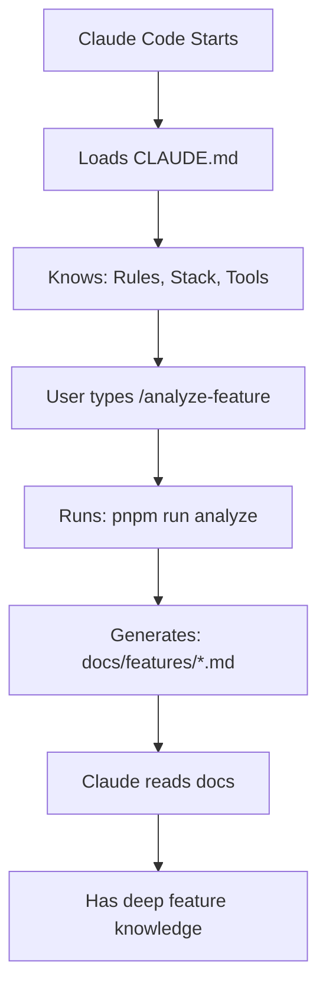

# Claude Code Configuration - SuperSpace

This folder contains Claude Code's project-specific knowledge base and custom workflows.

## 📁 Contents

```
.claude/
├── README.md              ← You are here
├── CLAUDE.md              ← Main knowledge base (loaded at startup)
├── SETUP_GUIDE.md         ← Complete setup & usage guide
├── settings.json          ← Project settings (shared)
├── settings.local.json    ← Local overrides (gitignored)
└── commands/              ← Custom slash commands
    ├── README.md
    ├── analyze-feature.md
    ├── feature-docs.md
    ├── list-features.md
    ├── analyze-all-features.md
    └── validate-project.md
```

## 🚀 Quick Start

### 1. How Claude Learns About This Project

When you start Claude Code in this project, it automatically loads **[CLAUDE.md](CLAUDE.md)** which contains:
- ✅ Project stack & architecture
- ✅ Development rules & guardrails
- ✅ Definition of Done (DoD)
- ✅ Available scripts & tools
- ✅ Feature system documentation

### 2. Custom Commands Available

Type `/` in Claude Code to see available commands:

| Command | Purpose |
|---------|---------|
| `/analyze-feature` | Analyze & document a feature |
| `/feature-docs` | Show feature documentation |
| `/list-features` | List all registered features |
| `/analyze-all-features` | Document all features |
| `/validate-project` | Run validations & tests |

### 3. Try It Now

```bash
# In Claude Code:
/analyze-feature cms

# This will:
# 1. Analyze the CMS feature
# 2. Generate documentation
# 3. Show comprehensive overview
```

## 📚 Documentation

### For Developers
- **[SETUP_GUIDE.md](SETUP_GUIDE.md)** - Complete guide on how this works
- **[commands/README.md](commands/README.md)** - All available commands

### For Claude
- **[CLAUDE.md](CLAUDE.md)** - Primary knowledge source (read this first!)
- **[docs/features/](../docs/features/)** - Generated feature docs

## 🎯 What This Achieves

### Before (Without Setup)
```
Developer: "What features exist in this project?"
Claude: "Let me search the codebase..."
```

### After (With Setup)
```
Developer: "/list-features"
Claude: "I have 29 registered features:
- Communication: chat, calls, status
- Productivity: tasks, calendar, projects
- Content: cms, wiki, documents
..."
```

### Real Example

```bash
# Developer wants to add a query to chat feature

# Traditional way:
# 1. Search for chat files
# 2. Read multiple files
# 3. Understand structure
# 4. Find where to add code
# 5. Check permissions

# With Claude Code + Setup:
Developer: "/analyze-feature chat"
Claude: "Chat feature has:
- 28 components
- 3 hooks
- 2 stores
- 0 existing queries (queries defined elsewhere)
- Settings enabled
- Files: ..."

Developer: "Add a new query to get unread count"
Claude: *Creates query with proper structure, permissions, RBAC*
```

## 🔧 How It Works



## ✅ What Claude Now Knows

1. **Project Architecture**
   - Stack: Next.js, Convex, shadcn/ui, Zustand
   - RBAC system & permissions
   - Audit logging requirements

2. **Development Rules**
   - Never bypass permission checks
   - Always validate with Zod
   - Tests must pass before commit
   - Audit events required

3. **Tools & Scripts**
   - `analyze:feature` - Feature analyzer
   - `list:features` - Feature registry
   - `validate:*` - Validation scripts
   - And more...

4. **Feature System**
   - Auto-discovery from `frontend/features/*/config.ts`
   - Registry at `lib/features/registry.server.ts`
   - Documentation in `docs/features/`

5. **When to Use What**
   - Before modifying: Analyze feature first
   - Before commit: Validate project
   - For onboarding: Read feature docs
   - For architecture: Analyze all features

## 📝 Maintenance

### Update Knowledge Base

```bash
# Edit guardrails/rules
code .claude/CLAUDE.md

# Or press # in Claude Code and type instruction
# Claude will automatically update CLAUDE.md
```

### Add New Command

```bash
# Create new command file
code .claude/commands/my-command.md

# Format:
---
description: Command description
---

Command instructions with $ARGUMENTS
```

### Generate Documentation

```bash
# Single feature
/analyze-feature cms

# All features
/analyze-all-features
```

### Validate Everything

```bash
/validate-project
```

## 🎓 Learn More

- **[SETUP_GUIDE.md](SETUP_GUIDE.md)** - Deep dive into how this works
- **[commands/README.md](commands/README.md)** - Command reference
- **[../scripts/features/README.md](../scripts/features/README.md)** - Script documentation
- **[../docs/5_FEATURE_REFERENCE.md](../docs/5_FEATURE_REFERENCE.md)** - Feature system guide

## 🤝 Contributing

When adding new features or major changes:

1. ✅ Update CLAUDE.md if rules change
2. ✅ Create commands for new workflows
3. ✅ Generate feature documentation
4. ✅ Commit to version control

## 🔒 Security

### ✅ Committed to Git
- `.claude/CLAUDE.md`
- `.claude/commands/`
- `.claude/settings.json`
- `docs/features/`

### ❌ Not Committed (Gitignored)
- `.claude/settings.local.json`
- Any files with secrets

## 📊 Impact

### Before This Setup
- Claude must search codebase for every question
- No persistent knowledge between sessions
- Repeating same explanations
- Risk of inconsistent patterns

### After This Setup
- Claude loads knowledge at startup
- Persistent understanding of project
- Quick access via commands
- Consistent adherence to rules

## 🎉 Result

**Claude Code now has institutional knowledge of SuperSpace project!**

Every AI coding session starts with:
✅ Understanding of architecture
✅ Knowledge of features
✅ Awareness of rules
✅ Access to tools
✅ Reference documentation

---

**Questions?** See [SETUP_GUIDE.md](SETUP_GUIDE.md) for detailed explanations.

**Ready to use?** Try: `/analyze-feature` or `/list-features`

---

**Version:** 1.0.0
**Last Updated:** 2025-10-27
**Maintained By:** SuperSpace Team
