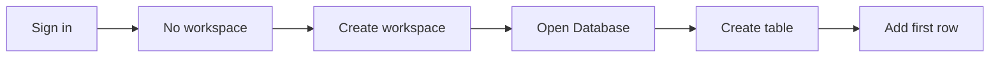
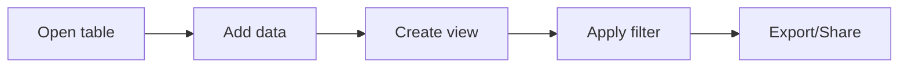
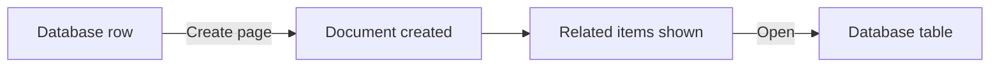

# Golden Path Workflows: UX Polish Plan (Pareto Layer 2)

**Date:** December 12, 2025  
**Status:** ✅ Complete  
**Prerequisite:** `PARETO_PRIORITY_FOUNDATION_HARDENING.md` (Complete)

## Why This Matters

SuperSpace already has deep capability, but users will only feel that value if:

- the first 5–10 minutes are smooth,
- core workflows are obvious without reading docs,
- “empty state → first success” happens fast.

Polishing a few golden paths improves retention, referrals, and de‑risks broad feature expansion.

## Definition: “Golden Path”

A golden path is a **high‑frequency, high‑value workflow** that:
1. New users attempt early.
2. Demonstrates the product’s differentiator (Universal Database + modular workspace).
3. Touches shared UI, onboarding, navigation, and error states.

## Proposed Golden Paths (v1)

### GP‑1: “First Workspace → First Database”

**User goal:** create a workspace and a usable database/table in under 2 minutes.

**Current touchpoints:**
- `frontend/shared/ui/layout/sidebar/components/onboarding-guard.tsx`
- `app/dashboard/workspace/*`
- `frontend/features/database/*`

**Friction to check:**
- Redirects feel abrupt (no guided context).
- Empty state actions are not always enabled or discoverable.
- “Choose workspace” CTA is disabled in some places.

**Improvements:**
1. **Guided onboarding shell**
   - Show a 3‑step checklist panel when `hasNoWorkspaces`.
   - Replace silent redirect with a context page explaining what’s next.
2. **Workspace creation UX**
   - One primary CTA in `/dashboard/workspace`.
   - Inline validation + optimistic UI.
3. **Database empty state**
   - Prominent “Create database” action.
   - 2–3 starter templates (Tasks, CRM, Content Calendar).
4. **First‑row success**
   - Auto‑focus first cell after create.
   - Undo toast after first edit.

**Success metrics:**
- Time to first database created (p50 < 120s).
- First‑session completion rate (>70%).

---

### GP‑2: “Database Use → Views/Filters → Share”

**User goal:** add data, switch to another view, filter, and share/export.

**Current touchpoints:**
- `frontend/features/database/views/*`
- `frontend/features/database/filters/*`
- `frontend/features/import-export/*` (if enabled)

**Friction to check:**
- View switching affordance clarity.
- Filter builder discoverability.
- Share/export CTA placement.

**Improvements:**
1. **View switcher clarity**
   - Tabbed or segmented control with icons + labels.
   - Show view preview on hover.
2. **Filter onboarding**
   - “Try filtering” inline hint on empty filter state.
   - Default “Status = Any” example for templates.
3. **Share/export**
   - One consistent “Share” button location in header.
   - Make export options contextual (CSV for table, PNG for gallery, etc.).
4. **Keyboard shortcuts**
   - Add `?` help modal listing 10 core shortcuts.

**Success metrics:**
- % users who create a 2nd view in session 1.
- % users who apply a filter in session 1.

---

### GP‑3: “Create Doc → Relate to Database”

**User goal:** create a document, link/relate it to a database row, and see bi‑directional navigation.

**Current touchpoints:**
- `frontend/features/documents/*`
- `frontend/features/database/properties/relation/*`

**Friction to check:**
- Discovering “relate” action.
- Context switching between doc and table.

**Improvements:**
1. **Doc creation from context**
   - “New doc” available in sidebar + in row context menu.
2. **Relation UX**
   - When adding a Relation property, show a 2‑step wizard:
     1) pick target database, 2) pick display property.
3. **Backlinks**
   - Auto‑render “Related items” section in docs.

**Success metrics:**
- % docs created from inside database context.
- % users creating a Relation property.

## Instrumentation Plan

- Use existing analytics feature to log events:
  - `onboarding.workspace_created`
  - `database.created`, `database.first_row_added`
  - `database.view_created`, `database.filter_applied`
  - `documents.created`, `relation.property_created`
- Add a lightweight dashboard in `frontend/features/analytics`.

## Testing Plan

- Add E2E tests for GP‑1 and GP‑2:
  - Signup → create workspace → create database → add row → create view → filter.
- Keep unit tests for low‑level database/property functions.

## Journey Maps (Before / After)

### GP1: First Workspace → First Database

**Before**
- Onboarding and empty states were less guided (fewer “next step” affordances).

**After**
- Workspace dashboard shows an onboarding checklist panel.
- Database empty state promotes templates + quick actions.

### GP2: Database Use → Views/Filters → Share

**Before**
- Filters/views discovery relied on user exploration.

**After**
- View switcher + filter onboarding hint makes discovery immediate.
- Analytics events + Events tab confirm the journey is instrumented.

### GP3: Create Doc ↔ Relate to Database

**Before**
- No lightweight way to link a doc to a specific database row from the UI.
- Docs didn’t show “Related items” backlinks.

**After**
- Database rows offer “Create page” / “Open page” actions.
- Documents Inspector auto-renders a “Related items” section with link/unlink + deep-link back to the database.

## Deliverables Checklist

- [x] Golden path journey maps (before/after flow + notes).
- [x] Onboarding UI checklist panel.
- [x] Database templates + empty state CTA.
- [x] View switcher + filter hints.
- [x] Doc ↔ database relation wizard + backlinks.
- [x] Analytics events + basic dashboard. (Events started: `onboarding.workspace_created`, `database.created`, `database.filter_applied`)
- [x] E2E golden path tests.

## Out of Scope (v1)

- Full Tasks feature implementation (currently placeholder).
- Advanced AI flows.
- Full marketplace / integrations polish.
